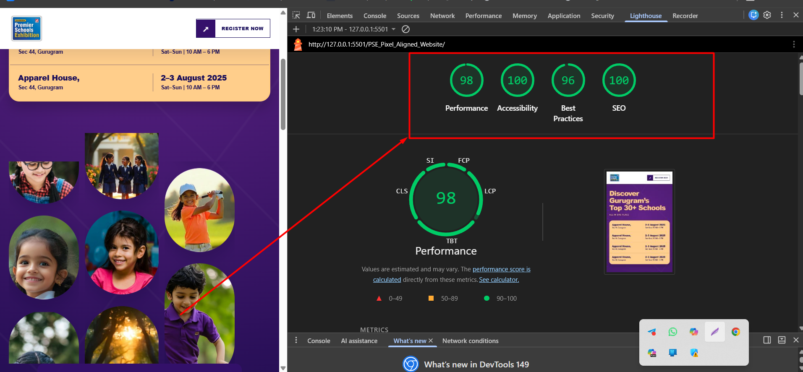

# Premier Schools Exhibition (PSE) Landing Page

A responsive landing page for **Premier Schools Exhibition (PSE)** built with semantic HTML5 and custom CSS only.

## Live Demo

Add your Netlify live link here after deployment:

```text
https://clientp2.netlify.app/
```

## Project Preview

> Add your screenshot inside `assets/screenshots/` folder and use the code below.


## Lighthouse Performance Test

The landing page was tested using Google Chrome Lighthouse in responsive mobile mode.

- Performance: **98**
- Accessibility: **100**
- Best Practices: **96**
- SEO: **100**



## Project Features

- Semantic HTML5 structure
- Custom CSS only
- No JavaScript
- No React, Bootstrap, Tailwind, or other frameworks
- BEM-style CSS class naming
- Fully responsive layout for desktop, tablet, and mobile
- Accessible skip-to-content link
- Visible keyboard focus states
- Native HTML form validation
- CSS-only hover effects and animations
- CSS-based image motion and logo marquee
- `prefers-reduced-motion` support for users who disable animations
- Responsive school cards with mobile scroll-snap layout
- Static enquiry form redirect to `thank-you.html`
- Custom `404.html` fallback page
- SEO support with `robots.txt` and `sitemap.xml`

## Sections Included

- Header with PSE logo and Register Now button
- Hero section with event information and enquiry form
- Exhibition statistics section
- Participating school logo section
- School category cards
- Pre-schedule appointment section
- Exhibition highlights / must-visit section
- Parent review section
- Gallery section
- Footer with office, contact, and social information

## Technologies Used

```text
HTML5
CSS3
Responsive Design
CSS Animations
CSS Media Queries
```

## Project Structure

```text
C_Project2/
│
├── assets/
│   ├── images/
│   ├── icons/
│   └── screenshots/
│       └── landing-page-desktop.png
│
├── css/
│   └── style.css
│
├── index.html
├── thank-you.html
├── 404.html
├── robots.txt
├── sitemap.xml
└── README.md
```

## How to Run the Project Locally

### Option 1: Using VS Code Live Server

1. Download or clone this repository.
2. Open the project folder in VS Code.
3. Install the **Live Server** extension if it is not already installed.
4. Open `index.html`.
5. Right-click inside the file.
6. Click **Open with Live Server**.

The project will open in your browser.

### Option 2: Open Directly in Browser

1. Download the project ZIP file.
2. Extract the ZIP file.
3. Open the project folder.
4. Double-click `index.html`.

> For the best local testing experience, use Live Server.

## Responsive Testing

The landing page is designed to work on:

- Desktop
- Laptop
- Tablet
- Mobile devices
- Chrome
- Firefox
- Microsoft Edge
- Safari
- Android browsers
- iPhone Safari

## Accessibility Notes

- Semantic HTML elements are used where appropriate.
- The page includes a skip-to-content link.
- Form fields include visible labels.
- Keyboard focus styles are included.
- CSS animations are reduced or disabled when the user enables `prefers-reduced-motion`.

## Author

**Rasel Ahmed**

GitHub: [raselahmed63840](https://github.com/raselahmed63840)
